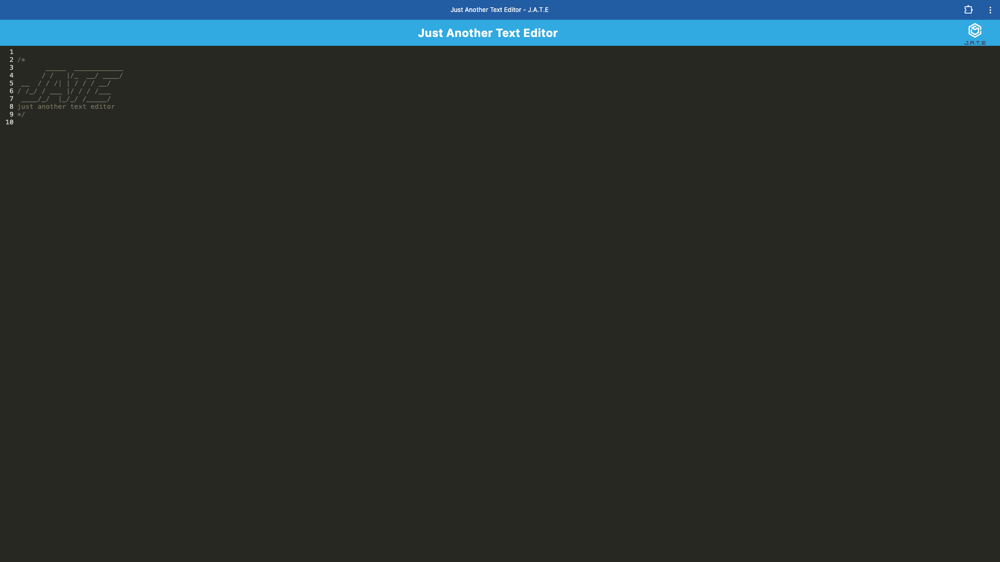

# C19-PWA-Editor

## Project Description

This Progressive Web Application (PWA) that allows users to create, save, and retrieve notes or code snippets, whether connected to the internet or offline. Built using Webpack, IndexedDB, and Workbox, this text editor provides a reliable experience for users looking to store content for later use. The application can be installed as a standalone app, ensuring that notes are always accessible, even without a network connection.

## Features

- **Offline Capability**: Works offline with IndexedDB.
- **Installable**: Add the app to your desktop.
- **Data Persistence**: Saves notes automatically.
- **Modern JavaScript**: Uses Babel for next-gen features.
- **Bundled with Webpack**: Efficient asset management.

## Usage - Local Installation

1. **Install**: Clone repo, run `npm install` in root.
2. **Start**: Run `npm run start` to launch the app.
3. **Install PWA**: Click "Install" to add to your desktop.

## Example(s)

[Demo Video]()

## Source Code

- Base code provided by: [The Coding Bootcamp](https://github.com/coding-boot-camp/cautious-meme)

- Modifications by [Lixiviate](https://github.com/Lixiviate)

- Code Assistance:
  - [MDN Web Docs](https://developer.mozilla.org/en-US/)
  - [W3Schools](https://www.w3schools.com/)
  - [edX Xpert Learning Assistant](https://www.edx.org/)
  - [Stack Overflow](https://stackoverflow.com/)
- Development Resources:
  - [Express.js](https://expressjs.com/)
  - [if-env](https://github.com/ericclemmons/if-env#readme)
  - [concurrently](https://github.com/open-cli-tools/concurrently#readme)
  - [nodemon](https://nodemon.io/)

## License

This project is licensed under the MIT license.
